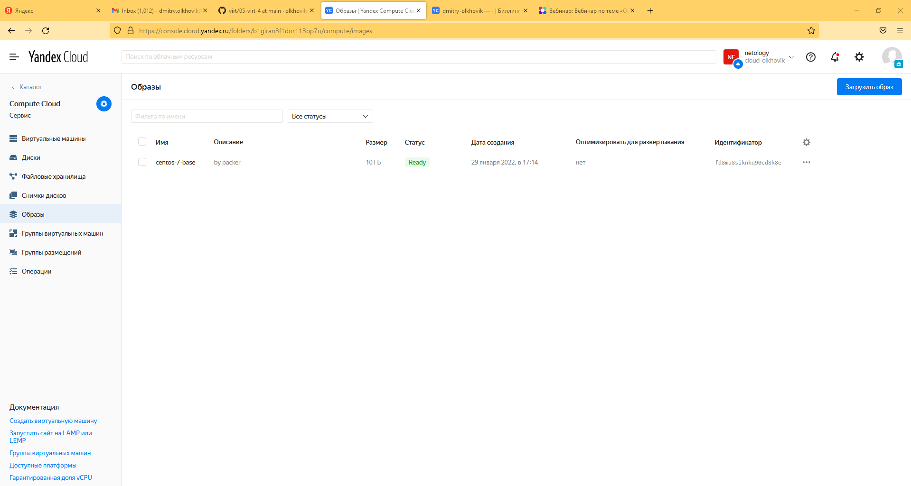
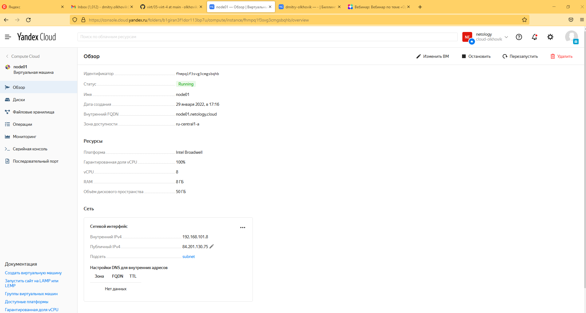
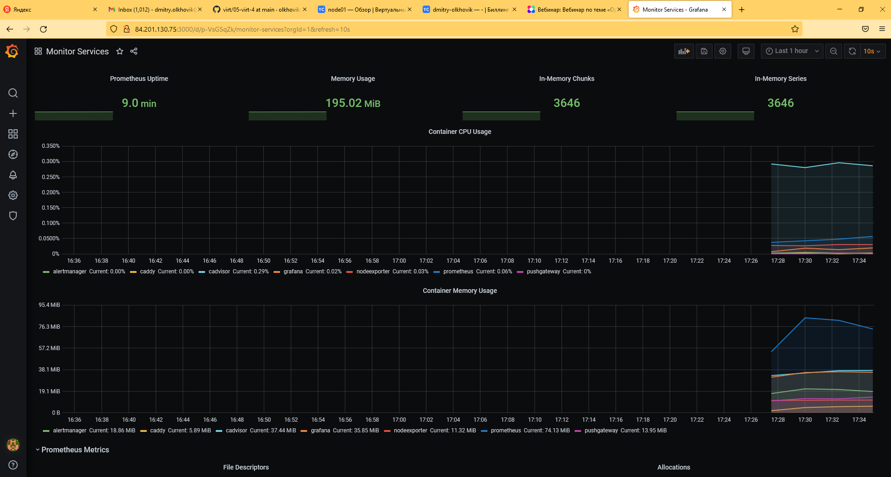
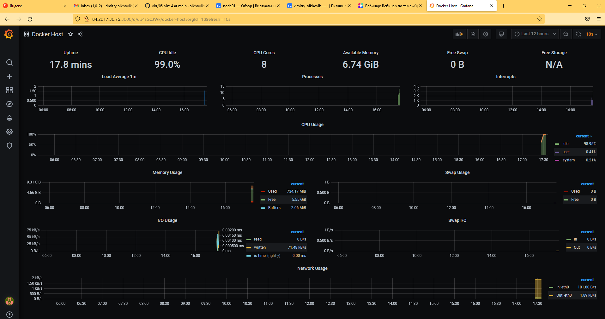

# **Домашняя работа к занятию 5.4 «Оркестрация группой Docker контейнеров на примере Docker Compose.**
## _Задача №1_

_Создать собственный образ операционной системы с помощью Packer._

_Для получения зачета, вам необходимо предоставить:_

- _Скриншот страницы, как на слайде из презентации (слайд 38)._

--------------------------------------------
Образ собран:

## _Задача №2_

_Создать вашу первую виртуальную машину в Яндекс.Облаке._

_Для получения зачета, вам необходимо предоставить:_

- _криншот страницы свойств созданной ВМ, как на примере ниже:_

----------------------------------------------------
Виртуальная машина создана:

## _Задача №3_

_Создать ваш первый готовый к боевой эксплуатации компонент мониторинга, состоящий из стека микросервисов._

_Для получения зачета, вам необходимо предоставить:_

- _Скриншот работающего веб-интерфейса Grafana с текущими метриками, как на примере ниже:_

-----------------------------------------------------------
Grafana с метриками:

## _Задача №4(*)_

_Создать вторую ВМ и подключить её к мониторингу развёрнутому на первом сервере._

_Для получения зачета, вам необходимо предоставить:_

- _Скриншот из Grafana, на котором будут отображаться метрики добавленного вами сервера._

-------------------------------------------------------------